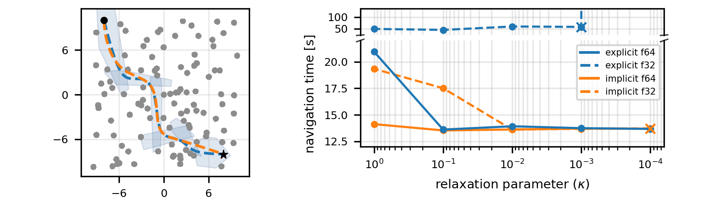
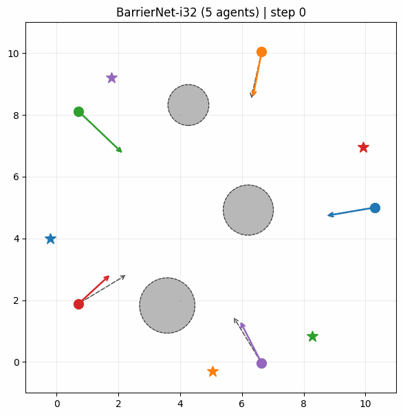
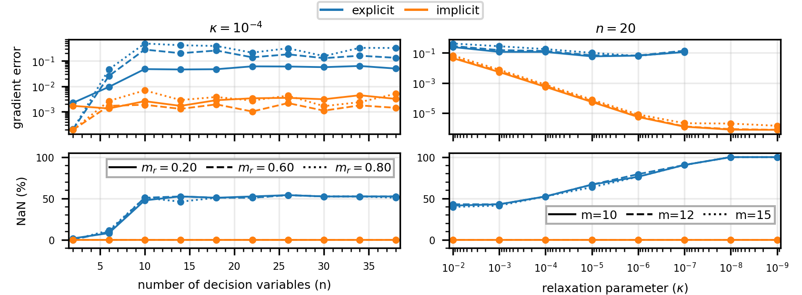

# qpax examples

Standalone examples and benchmarks for the [qpax](https://github.com/qpax-solver/qpax) differentiable QP solver.

## Quickstart

```bash
# 1. Install qpax and the example deps:
pip install -r requirements.txt

# 2. Run the smallest example end-to-end:
# cd example_name
# python example_name.py (or the CLI command in the example's readme)
```

## Examples

| Example | Method | Description | Paper |
| --- | --- | --- | --- |
| [`bilevel_trajectory_optimization`](examples/bilevel_trajectory_optimization/)<br> | Bilevel trajectory optimization | Inner QP ensures safety and smoothness; outer L-BFGS reduces navigation time. | [Mellinger et al.](https://ieeexplore.ieee.org/abstract/document/5980409/?casa_token=s0gH-F5fiMAAAAAA:D9MR5jPBzJ6sRLVuqPaOUojz_rHMyWj6K1ustjUnrOYKgRN6CszvmTtullcCaLQv5iclZrD1Ig) |
| [`learning_safety_filter`](examples/learning_safety_filter/)<br> | Learning from demonstrations | Learning a multi-agent safety-filter CBF from expert demonstrations. | [Xiao et al.](https://ieeexplore.ieee.org/abstract/document/10077790?casa_token=buet2dfHOkwAAAAA:ewUqvUrxVszaXjj3iXqfkEq7MCeRLTs1q7PadFM0H2c8e0jgwfaMSS5tblJY2usrpuxIkM6Gvg) |
| [`autotuning_mpc`](examples/autotuning_mpc/)<br> | MPC autotuning from demonstrations | Learns MPC cost weights from demonstration trajectories. | [Adabag et al.](https://arxiv.org/abs/2510.06179)|
| [`backend_comparison`](examples/backend_comparison/)<br> | Theoretical comparison | Comparison of implicit and explicit backend of the qpax solver. | [Arrizabalaga et al.](https://arxiv.org/abs/2605.17913) |

Each example folder ships its own `README.md` with the exact run command,
CLI/config options, and output paths.

## Projects using qpax

The following open-source projects use [qpax](https://github.com/qpax-solver/qpax) in compelling real-world applications:

- [cbfpy](https://github.com/StanfordASL/cbfpy): Control Barrier Functions in Python and JAX.
- [oscbf](https://github.com/StanfordASL/oscbf): Safe, high-performance, task-consistent manipulator control.
- [frax](https://github.com/StanfordASL/frax): Fast robot kinematics and dynamics in JAX.

These projects are good references for seeing how qpax can be used beyond the examples in this repository.

If you are using qpax and would like to be listed here, open a PR or issue and we will be happy to add your project.

## Citation

If you use these examples or the qpax solver in academic work, please cite:

```bibtex
@misc{arrizabalaga2026differentiableinteriorpointmethodsingle,
      title={A Differentiable Interior-Point Method in Single Precision}, 
      author={Jon Arrizabalaga and Kevin Tracy and Zachary Manchester},
      year={2026},
      eprint={2605.17913},
      archivePrefix={arXiv},
      primaryClass={math.OC},
      url={https://arxiv.org/abs/2605.17913}, 
}
```


## License

This project is licensed under the Apache License 2.0 — see the
[qpax](https://github.com/qpax-solver/qpax) repository for details.
